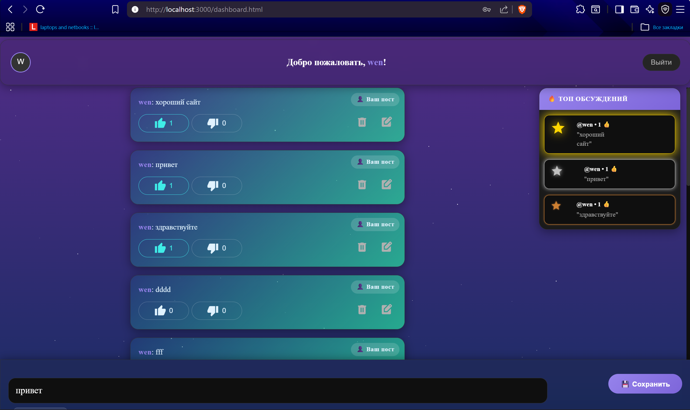
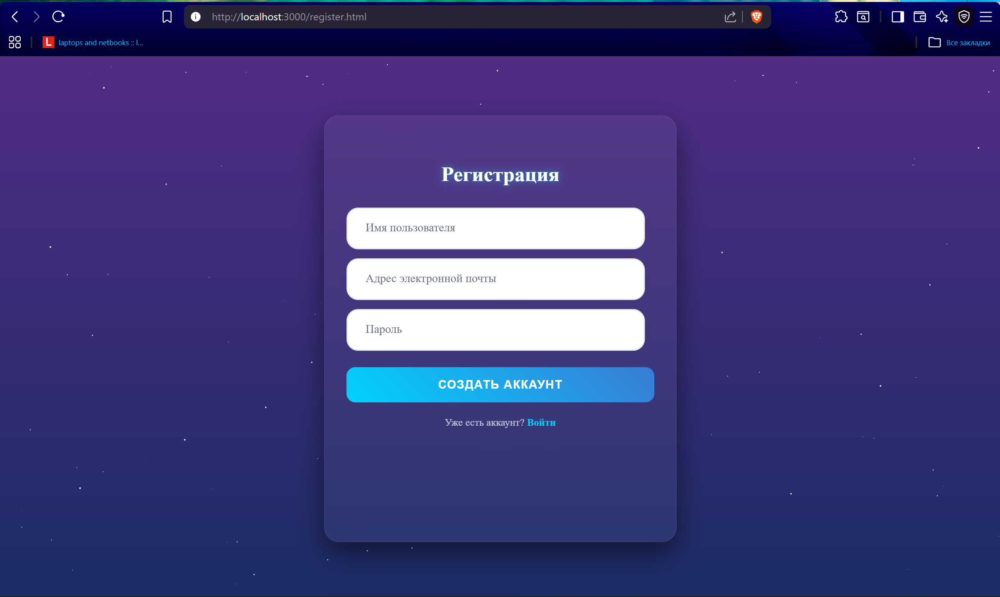
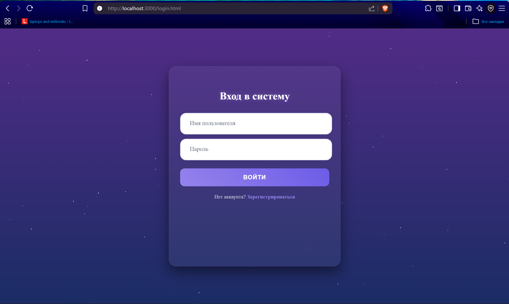

# 🚀 PostSpace

[](https://opensource.org/licenses/MIT)
[](https://nodejs.org/)
[](https://expressjs.com/)

**Современная социальная платформа** для обмена постами с системой лайков, дизлайков и рейтингом топ-постов.

---

## 📋 Содержание

- [О проекте](#-о-проекте)
- [Возможности](#-возможности)
- [Технологии](#-технологии)
- [Установка](#-установка)
- [Структура проекта](#-структура-проекта)
- [API Endpoints](#-api-endpoints)
- [Скриншоты](#-скриншоты)
- [Запуск](#-запуск)
- [Лицензия](#-лицензия)
- [Автор](#-автор)

---

## 📖 О проекте

**PostSpace** — это полнофункциональное веб-приложение, которое позволяет пользователям:
- Создавать аккаунты и авторизоваться
- Публиковать посты
- Лайкать и дизлайкать контент
- Отслеживать топ-3 популярных поста
- Редактировать и удалять свои публикации

Проект разработан с использованием **модульной архитектуры** и современных практик безопасности.

---

## ✨ Возможности

### 🔐 Аутентификация
- Регистрация новых пользователей
- Безопасный вход с JWT-токенами
- Хэширование паролей (bcrypt)

### 📝 Работа с постами
- Создание и публикация постов
- Редактирование своих постов
- Удаление постов с функцией Undo
- Отображение времени создания и редактирования

### ❤️ Реакции
- Лайки и дизлайки
- Автоматическое переключение (лайк → дизлайк)
- Подсчёт количества реакций

### 🏆 Топ-посты
- Автоматический расчёт топ-3 по лайкам
- Обновление в реальном времени
- Красивое отображение с звездами 

### 🎨 UI/UX
- Адаптивный дизайн
- Анимированный фон со звёздами
- Интуитивная навигация
- Уведомления о действиях

---

## 🛠 Технологии

### Backend
- **Node.js** — среда выполнения
- **Express.js** — веб-фреймворк
- **SQLite3** — лёгкая БД
- **JWT** — аутентификация
- **Bcrypt** — хэширование паролей
- **Helmet** — защита заголовков
- **CORS** — кросс-доменные запросы
- **Dotenv** — переменные окружения

### Frontend
- **HTML5** — семантическая разметка
- **CSS3** — стилизация с анимациями
- **Vanilla JavaScript** — логика клиента
- **Material Icons** — иконки

### Инструменты
- **Git** — контроль версий
- **VS Code** — редактор кода
- **Nodemon** — авто-перезагрузка сервера

---

## 📦 Установка

### 1. Клонируйте репозиторий
```bash

git clone https://github.com/GermanProg/Website_PostSpace.git
cd Website_PostSpace
```
### 1. Установите зависимости
```bash

cd backend
npm install
```
### Создайте файл backend/.env:
```
PORT=3000
JWT_SECRET=your_super_secret_key_here_min_32_chars
NODE_ENV=development
DB_PATH=./database.sqlite
```
###  Сгенерируйте секретный ключ в терминале:
```
node -e "console.log(require('crypto').randomBytes(32).toString('hex'))"
```
### Запустите сервер:
```
# Обычный запуск
node server.js

# Или с авто-перезагрузкой (требуется nodemon)
npm run dev
```
### Структура проекта:
```
Website_PostSpace/
├── backend/
│   ├── config/
│   │   └── database.js          # Настройка БД
│   ├── middleware/
│   │   └── auth.js              # Проверка JWT
│   ├── models/
│   │   ├── User.js              # Модель пользователя
│   │   └── Post.js              # Модель поста
│   ├── routes/
│   │   ├── auth.js              # Маршруты авторизации
│   │   └── posts.js             # Маршруты постов
│   ├── .env                     # Переменные окружения
│   ├── .env.example             # Шаблон переменных
│   ├── .gitignore               # Git исключения
│   ├── server.js                # Точка входа
│   └── package.json             # Зависимости
│
└── public/
    ├── css/
    │   ├── components/
    │   │   ├── Dashboard.css
    │   │   ├── Login.css
    │   │   └── Register.css
    │    │    └── style.css
    │    │    └── Glav_title.css
    │   └── main.css
    ├── js/
    │   ├── dashboard.js
    │   ├── login.js
    │   └── register.js
    │   └── Main.js
    │   └── DashTopComment.js
    ├── index.html
    ├── dashboard.html
    ├── login.html
    └── register.html
```
####  Страница общения `Визуализация Dashboard`

####  Страница регистрации `Визуализация Register`

####  Страница входа `Визуализация Login`

